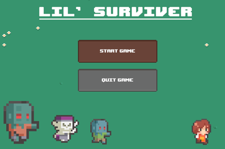

# Game Design Document
My game for the GMD1 course is a 2D top-down shooter, inspired by Vampire Survivors. The player begins weak, armed with a single weapon, and gains power by defeating enemies and collecting XP. As they level up, they unlock new weapons or effects. The game is designed for an arcade machine setup and will take advantage of additional button inputs for player-triggered abilities. The genre is action/rogue-lite, with retro arcade twist targeting fans of arcade shooters and progression-based gameplay. Development is scoped to a solo project, with flexibility to scale complexity based on progress.

## Gameplay  
Players navigate an open map, shooting waves of enemies to survive as long as possible. XP dropped by enemies allows the player to level up and choose upgrades. Some weapons fire automatically, while others require manual activation. The in-game GUI will display player health, current level, XP bar, available weapons, and timers or cooldowns for active abilities. Game progression increases difficulty over time, with enemies becoming faster, more numerous, and more varied.

## Mechanics  
Core Mechanics include:  
- **Movement**: The game will be possible to be played on keyboard with arrow keys or WASD, as well as with XBOX mapped controls (playable on VIA arcade machine).  
- **Combat**: Automatic and manual weapon firing.  
- **Leveling System**: Collect XP from defeated enemies to fill XP bar; level-ups trigger upgrade choices. XP amount to level-up will increase as the game progresses.  
- **Abilities**: Activated via buttons (on keyboard or XBOX mapped controls)  
- **Enemy AI**: Basic pathfinding to chase the player  

Physics will be simple 2D collision detection for movement, projectiles, and area-of-effect damage.

## Game Elements  
- **Worldbuilding**: Lone survivor against rising chaos of the post-apocalyptic world overrun by zombies.  
- **Characters**: Single player. Multiple enemy types with distinct behaviors.  
- **Level Design**: Expanding enemy density and new enemy types every few minutes of playtime. It takes place in only one location  

## Assets  
Free assets from Unity Store will be utilized, as well as assets found on the internet end self-made assets.  
- **Visuals**: 2D pixel art for characters, weapons and enemies. Cute aesthetic, contrasting the dark concept of the game.  

- **Audio**: Retro-inspired music loop, punchy arcade-style sound effects for power-ups.  
- **UI**: Minimalist, clear HUD with pixel-fonts and visual effects for upgrades

## Milestones  
1. **Core Gameplay**: Finding assets. Basic player movement, enemy spawning and chasing, first weapon firing a projectile.  
2. **Abilities, Weapons & Overlay**: Add an area-effect weapon, an active speed boost ability, and a short invincibility ability. Make UI for game overlay. 
3. **Progression System**: Implement weapon leveling (e.g. more projectiles), evolving enemy waves. Finishing touches (menu, sound, etc.) 

