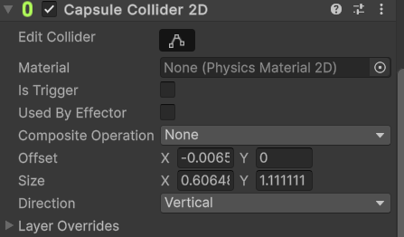
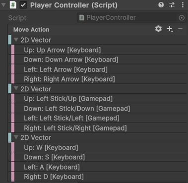

# Dev update 1: Core Gameplay
In this post, I’ll walk through the work completed for Milestone 1 of my GMD1 game project. The goal was to build the foundation: basic movement, making enemies chase the player, and firing a basic projectile.  

## Player Physics  
The player GameObject uses a Rigidbody2D component with the Body Type set to Dynamic. This allows the player to be physically pushed by enemies, adding an extra layer of tension during combat. Since this is a top-down game, gravity isn't needed, so it’s disabled in the project settings. I use linear damping to prevent the player from sliding too far after being pushed.



I implemented 2D movement using Unity’s Input System, supporting both keyboard and Xbox gamepad input. This is important since the game will be played on VIA’s arcade machine. The player can move using WASD or arrow keys on keyboard, and the left joystick on gamepad.  
The Unity Input System makes it very easy to add bindings for different platforms, without code changes. It’s used by simply adding a public InputAction in the script and assigning it in the Unity inspector  

```csharp
public InputAction MoveAction;
#code snippet from PlayerController.cs
```  



In the code, player movement happens in both `Update()` and `FixedUpdate()`.  
`Update()` runs once per frame, and here the `moveInput` (a Vector2) is read from the `MoveAction` of the Unity Input System.  
`FixedUpdate()` runs at a consistent rate, independent of frame rate, and here the input is used to move the player according to the movement speed.  
Putting this in `FixedUpdate()` ensures consistent speed, regardless of frame rate.  

```csharp
 void Update()
 {
     moveInput = MoveAction.ReadValue<Vector2>();
     animator.SetFloat("Speed", Mathf.Abs(moveInput.x) + Mathf.Abs(moveInput.y));

     if (moveInput.x > 0 && !isFacingRight)
     {
         FlipPlayer();
     }
     else if (moveInput.x < 0 && isFacingRight)
     {
         FlipPlayer();
     }
 }

 void FixedUpdate()
 {
     rb.MovePosition(rb.position + moveInput * movementSpeed * Time.fixedDeltaTime);
 }
 #code snippet from PlayerController.cs
```  

## First Weapon  
To create the first weapon (a bullet), I made an empty GameObject (`wpn_bullet`) as a child of the player. This GameObject has a script that handles when and where to shoot. It uses an `attackSpeed` variable and a timer that increases in `Update()`. When the timer exceeds `attackSpeed`, it resets and spawns a bullet projectile at the player’s position, facing the player’s current direction.  
```csharp
 void Update()
 {
     if (timer < attackSpeed)
     {
         timer += Time.deltaTime;
         return;
     }
     timer = 0;
     SpawnBullet();
 }
 private void SpawnBullet()
 {
     int currentLevel = level;

     if (currentLevel == 1)
     {
         SpawnDirectionalBullet(player.isFacingRight ? Vector3.right : Vector3.left);
     }
...
#code snippet from BulletWeaponController.cs
```


The `bulletProjectile` script handles collision in `OnTriggerEnter2D()`, where it checks if the bullet hits an enemy and then applies damage.  
```csharp
 void OnTriggerEnter2D(Collider2D other)
 {
     if (other.gameObject.CompareTag("Enemy"))
     {
         other.gameObject.GetComponent<EnemyController>().TakeDamage(damage);
         Destroy(gameObject);
     }

 }
 #code snippet from BulletProjectile.cs
 ``` 

## Enemy Script  
The enemies in the game are controlled by a script that gives them very basic AI. All enemies use the same `EnemyController` script, which makes them chase the player, react to damage, and drop XP when defeated. The idea is to keep the code general enough that it can be reused for different enemy types later on, without having to rewrite or duplicate logic.  

In the Unity editor, each enemy is given a speed value and a reference to the player’s position (the target). In `FixedUpdate()`, the enemy calculates the direction toward the player and moves in that direction using `rg.linearVelocity`. This makes the enemies always follow in on the player from any spawn position.  
```csharp
  private void FixedUpdate()
  {
      Vector3 direction = (target.position - transform.position).normalized;
      rg.linearVelocity = direction * speed;

      if (direction.x > 0 && !isFacingRight)
          Flip();
      else if (direction.x < 0 && isFacingRight)
          Flip();
  }
  #code snippet from EnemyController.cs
```  
The enemy has the public `TakeDamage()` function which can be called from other scripts to deal damage to the enemy. If its health reaches zero, the `Die()` function is called, which destroys the GameObject and spawns an XP prefab at its position.  
```csharp
 public void TakeDamage(float damage)
 {
     health = health - damage;
     healthbar.SetValue(health);
     if (health <= 0)
         Die();
 }
 private void Die()
 {
     Destroy(gameObject);
     GameObject exp = Instantiate(expPrefab);
     exp.transform.position = transform.position;
 }
 #code snippet from EnemyController.cs
```  
When making the script, I made sure to expose the values `speed`, `damage`, `maxHealth`, as well as the XP prefab, to make the script generic. That way I can create different enemy types, using the same script and just changing values in the inspector.  

## Conclusion  
After this milestone, the core mechanics of the game is established. There is now a player able to move around and passively shooting bullets. There are enemies following the players, which can take damage and die.  
